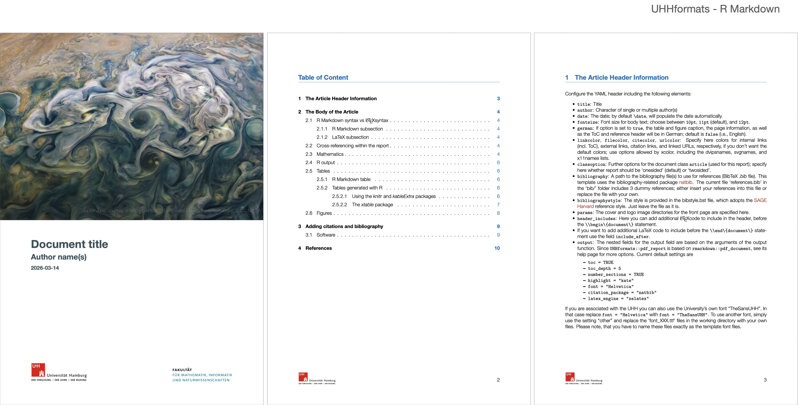
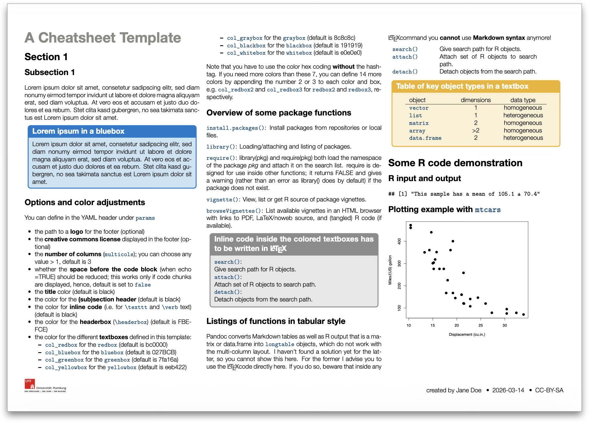
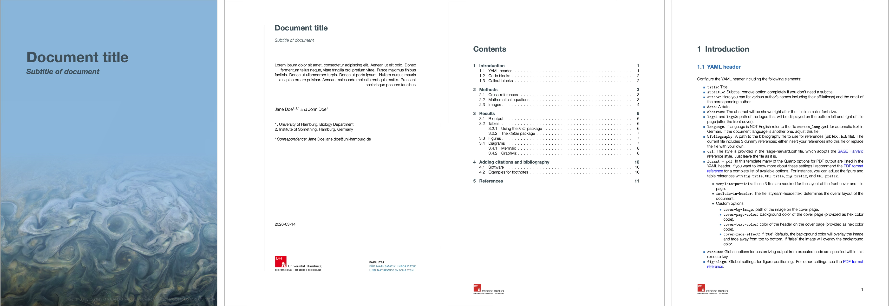
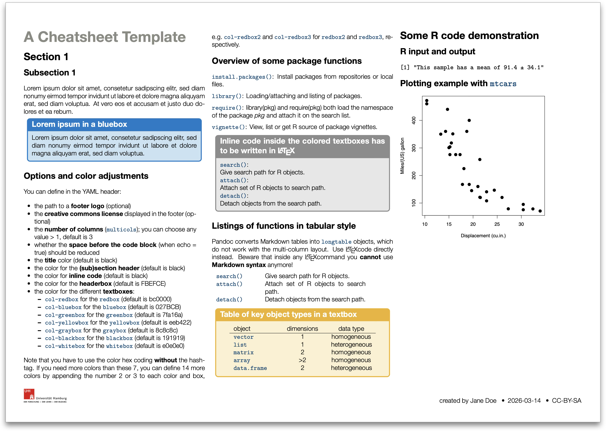
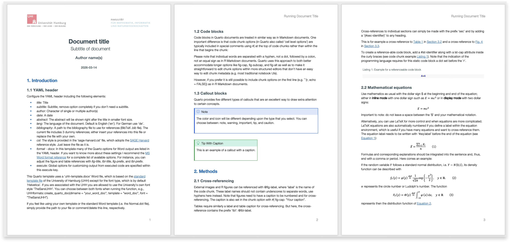

<!-- README.md is generated from README.Rmd. Please edit that file -->

# UHHformats 

[](https://github.com/saskiaotto)
[](LICENSE)

This R package provides ready-to-use **R Markdown** and **Quarto**
templates for HTML, PDF, and Microsoft Word output formats. The
templates are designed for the Department of Biology, University of
Hamburg (UHH), and its *Data Science in Biology* program, but can be
used by anyone — logos and styles are easily customizable via the YAML
header.

All templates ship with example text and code for formatting, equations,
tables, figures with cross-references, and citations.

For thesis templates see the companion package
[UHHthesis](https://github.com/uham-bio/UHHthesis) or the separate
[Quarto extension](https://github.com/uham-bio/quarto-UHHthesis).

## Contents

- [Available templates](#available-templates)
- [Installation](#installation)
- [Prerequisites](#prerequisites)
  - [Quarto CLI](#quarto-cli)
  - [Pandoc](#pandoc)
  - [LaTeX (for PDF output)](#latex-for-pdf-output)
- [Getting started](#getting-started)
  - [R Markdown](#r-markdown)
  - [Quarto](#quarto)
- [Template gallery](#template-gallery)
  - [R Markdown templates](#r-markdown-templates)
    - [html_doc – HTML document](#html_doc----html-document)
    - [pdf_doc – Simple PDF document](#pdf_doc----simple-pdf-document)
    - [pdf_report – PDF report](#pdf_report----pdf-report)
    - [pdf_cheatsheet – PDF cheat
      sheet](#pdf_cheatsheet----pdf-cheat-sheet)
    - [word_doc – Word document](#word_doc----word-document)
  - [Quarto templates](#quarto-templates)
    - [html_doc – HTML document](#html_doc----html-document-1)
    - [pdf_doc – Simple PDF document](#pdf_doc----simple-pdf-document-1)
    - [pdf_report – PDF report](#pdf_report----pdf-report-1)
    - [word_doc – Word document](#word_doc----word-document-1)
- [Useful resources](#useful-resources)
- [Credits](#credits)

## Available templates

| Template            | Output | R Markdown function | Quarto template  |
|:--------------------|:-------|:--------------------|:-----------------|
| HTML document       | HTML   | `html_doc()`        | `html_doc`       |
| Simple PDF document | PDF    | `pdf_doc()`         | `pdf_doc`        |
| PDF report          | PDF    | `pdf_report()`      | `pdf_report`     |
| PDF cheat sheet     | PDF    | `pdf_cheatsheet()`  | `pdf_cheatsheet` |
| Word document       | Word   | `word_doc()`        | `word_doc`       |

The default font is Helvetica. PDF and Word templates also support the
University’s own font TheSans UHH (available to UHH members).

> **Backward compatibility:** The old function names `html_simple()` and
> `pdf_simple()` still work as aliases.

See the template gallery below for screenshots of each template.

## Installation

Install from GitHub:

``` r
# Using the package 'pak' (recommended)
if (!require("pak")) install.packages("pak")
pak::pak("uham-bio/UHHformats")

# Alternatively, using 'remotes'
if (!require("remotes")) install.packages("remotes")
remotes::install_github("uham-bio/UHHformats", build_vignettes = TRUE)
```

Required dependencies (rmarkdown, knitr, bookdown) are installed
automatically.

## Prerequisites

### Quarto CLI

For Quarto templates, install the [Quarto
CLI](https://quarto.org/docs/get-started/). To render `.qmd` files from
R, also install the quarto R package:

``` r
install.packages("quarto")
```

### Pandoc

R Markdown and Quarto use [Pandoc](https://pandoc.org/) to convert
documents. RStudio ships with its own Pandoc installation. If you render
from the console without RStudio, you need Pandoc installed on your
system:

- Installation: <https://pandoc.org/installing.html>
- Minimum required version: 2.17

### LaTeX (for PDF output)

For PDF output you also need a LaTeX distribution. Depending on your
operating system there are different distributions you can use, e.g. for
Mac there is [MacTeX](http://www.tug.org/mactex/), which includes
[TeXShop](https://pages.uoregon.edu/koch/texshop/), a nice Mac-only
editor for .tex documents. For other OS see here:
<https://www.latex-project.org/get/>

An easy way to install LaTeX on any platform is with the
[tinytex](https://yihui.org/tinytex/) R package:

``` r
install.packages("tinytex")
tinytex::install_tinytex()
# After restarting RStudio, confirm that you have LaTeX with
tinytex:::is_tinytex()
```

TinyTeX is a custom LaTeX distribution based on TeX Live that is small
in size but that includes most relevant functions (for R users). You
may, however, still need to install a few extra LaTeX packages on your
first attempt to knit when you use this package.

Although LaTeX is a powerful and popular tool in Academia, it can take a
while to learn the syntax and to find the correct formatting. R Markdown
and the PDF template in this package offer a much simpler syntax and the
direct embedding of figures and tables, but at the cost of losing some
of the expressiveness of LaTeX. However, you can insert LaTeX code
directly into the R Markdown files and also add LaTeX packages and
format styles in the YAML header.

If you want to know more about LaTeX, a good start is the *overleaf*
tutorial (and its entire documentation):
<https://www.overleaf.com/learn/latex/Learn_LaTeX_in_30_minutes>

## Getting started

See `vignette("UHHformats")` for a full walkthrough.

### R Markdown

In RStudio: **File \> New File \> R Markdown \> From Template**, then
select a UHHformats template. Or from the console:

``` r
UHHformats::create_rmd_doc(dirname = "my_report", template = "pdf_report")
```

### Quarto

``` r
UHHformats::create_quarto_doc(dirname = "my_html", template = "html_doc")
```

------------------------------------------------------------------------

## Template gallery

### R Markdown templates

#### html_doc – HTML document

A simple HTML document with a fixed table of contents, code folding, and
lightbox image display. Uses `bookdown::html_document2` by default,
supporting automatic figure/table numbering and cross-references.

<figure>

<figcaption aria-hidden="true">html_doc template</figcaption>
</figure>

#### pdf_doc – Simple PDF document

A PDF/LaTeX article suitable for student assignments. Supports English
and German, customizable logos and cover image. Wrapper around
`rmarkdown::pdf_document`.

<figure>

<figcaption aria-hidden="true">pdf_doc template</figcaption>
</figure>

#### pdf_report – PDF report

A report-style PDF with cover page, header/footer, and table of
contents. Suitable for project reports. Wrapper around
`rmarkdown::pdf_document`, inspired by the
[rticles](https://github.com/rstudio/rticles) and
[ireports](https://github.com/INWTlab/ireports) packages.

<figure>

<figcaption aria-hidden="true">pdf_report template</figcaption>
</figure>

#### pdf_cheatsheet – PDF cheat sheet

A landscape A4 cheat sheet with configurable columns, colored textboxes,
and adjustable font sizes. Based on [Sarah Lang’s LaTeX
template](https://www.overleaf.com/latex/templates/colourful-cheatsheet-template/qdsshbjktndd).

<figure>

<figcaption aria-hidden="true">pdf_cheatsheet template</figcaption>
</figure>

#### word_doc – Word document

A Microsoft Word document using the UHH corporate design template.
Wrapper around `bookdown::word_document2`, supporting automatic language
switching for figure/table captions.

<figure>

<figcaption aria-hidden="true">word_doc template</figcaption>
</figure>

### Quarto templates

#### html_doc – HTML document

A Quarto HTML page with navigation bar and UHH logo. Supports all
standard Quarto HTML features.

<figure>

<figcaption aria-hidden="true">Quarto html_doc template</figcaption>
</figure>

#### pdf_doc – Simple PDF document

A simple Quarto PDF document, similar in style to the R Markdown
`pdf_doc` template.

<figure>

<figcaption aria-hidden="true">Quarto pdf_doc template</figcaption>
</figure>

#### pdf_report – PDF report

A report-style Quarto PDF with customizable cover page, title page, and
logos.

<figure>

<figcaption aria-hidden="true">Quarto pdf_report template</figcaption>
</figure>

#### pdf_cheatsheet – PDF cheat sheet

A Quarto-based cheat sheet with configurable columns, colored textboxes,
and adjustable font sizes (see R Markdown template).

<figure>

<figcaption aria-hidden="true">Quarto pdf_cheatsheet
template</figcaption>
</figure>

#### word_doc – Word document

A Quarto Word document using the UHH corporate design template.

<figure>

<figcaption aria-hidden="true">Quarto word_doc template</figcaption>
</figure>

------------------------------------------------------------------------

## Useful resources

- R Markdown
  - The official [R Markdown
    documentation](https://rmarkdown.rstudio.com/lesson-1.html) from
    RStudio
  - R Markdown [reference
    guide](https://www.rstudio.com/wp-content/uploads/2015/03/rmarkdown-reference.pdf)
  - R Markdown
    [cheatsheet](https://github.com/rstudio/cheatsheets/raw/master/rmarkdown-2.0.pdf)
  - The online book [R Markdown: The Definitive
    Guide](https://bookdown.org/yihui/rmarkdown/) by Yihui Xie, J. J.
    Allaire, and Garrett Grolemund
- Quarto
  - The official [Quarto guide](https://quarto.org/docs/guide/)
  - Quarto’s [Gallery](https://quarto.org/docs/gallery/)
- LaTeX
  - The official [LaTeX help and
    documentation](https://www.latex-project.org/help/documentation/)
  - The [overleaf](https://www.overleaf.com/learn) documentation
- W3Schools Online Web Tutorial for
  [HTML](https://www.w3schools.com/html/default.asp) and for
  [CSS](https://www.w3schools.com/css/default.asp).

## Credits

- Julien Barnier’s [rmdformats](https://github.com/juba/rmdformats)
  package
- The [rticles](https://github.com/rstudio/rticles) package
- INWTlab’s [ireports](https://github.com/INWTlab/ireports) package
- Sarah Lang’s [LaTeX cheat sheet
  template](https://www.overleaf.com/latex/templates/colourful-cheatsheet-template/qdsshbjktndd)
- Eli Holmes’ [quarto
  titlepages](https://nmfs-opensci.github.io/quarto_titlepages/)
  collection
