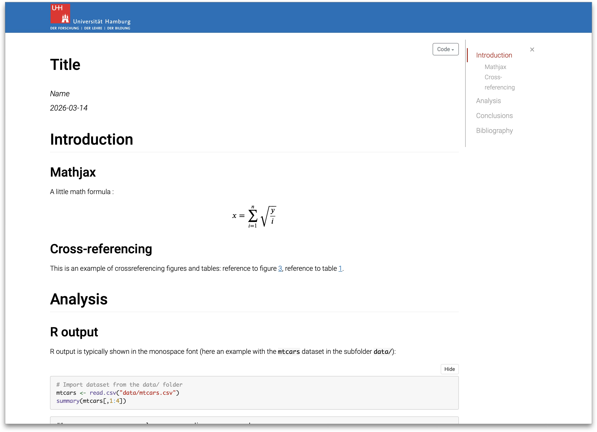
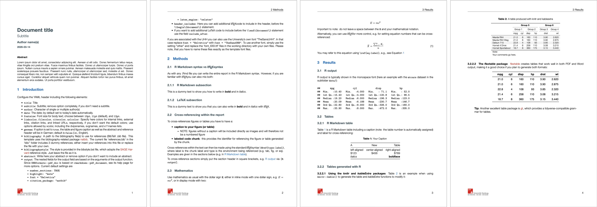
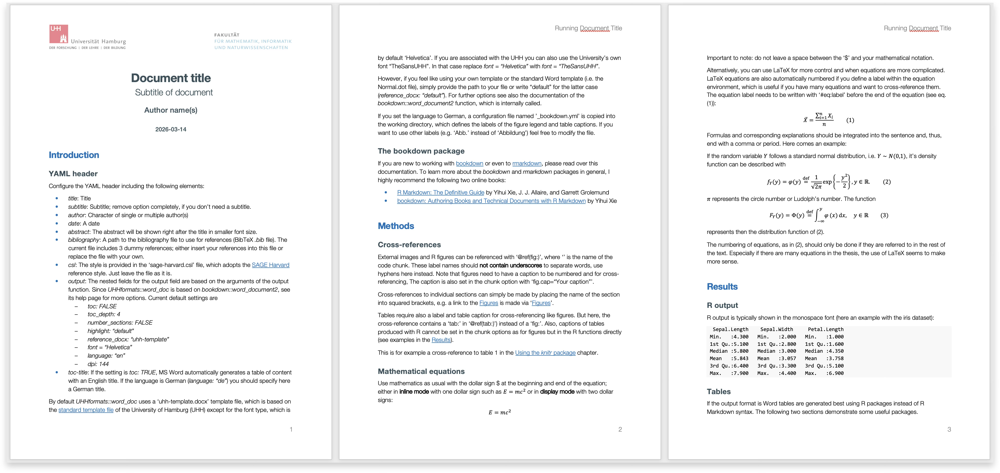
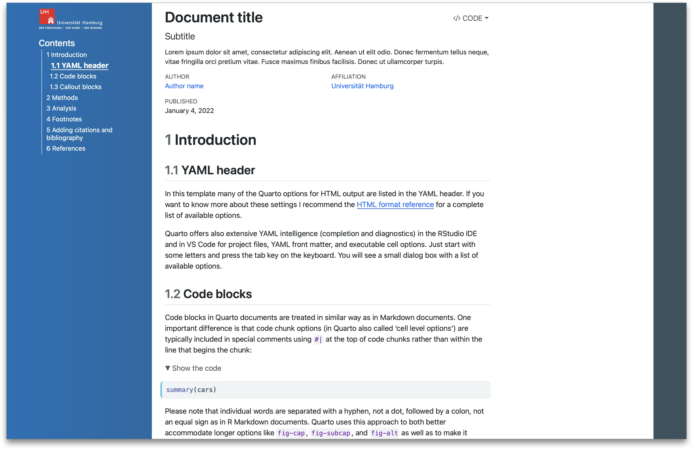
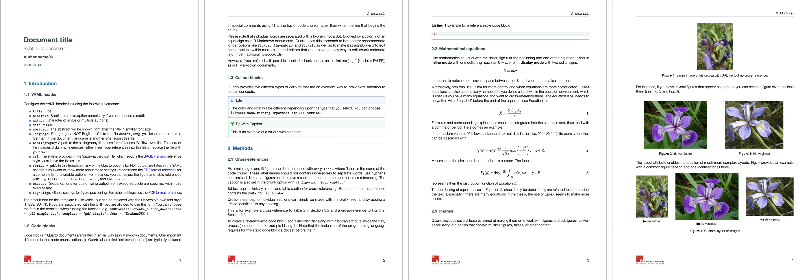

# Template gallery

Each template ships with example content covering text formatting,
equations, tables, figures with cross-references, and citations. Click
**Download demo** to get a ready-to-open example file.

------------------------------------------------------------------------

## R Markdown templates

### HTML document (*html_doc*)

A self-contained HTML page with a fixed table of contents, code folding,
and lightbox image display. Uses
[`bookdown::html_document2`](https://pkgs.rstudio.com/bookdown/reference/html_document2.html)
for automatic figure/table numbering and cross-references.

[Download demo
(HTML)](https://github.com/uham-bio/UHHformats/raw/master/resources/examples/demo_rmd_html_doc.html)

------------------------------------------------------------------------

### Simple PDF document (*pdf_doc*)

A clean PDF article suitable for student assignments. Supports English
and German, customisable logos and header/footer.

[Download demo
(PDF)](https://github.com/uham-bio/UHHformats/raw/master/resources/examples/demo_rmd_pdf_doc.pdf)

------------------------------------------------------------------------

### PDF report (*pdf_report*)

A report-style PDF with a cover page, header/footer, and table of
contents. Suitable for project reports and course work.

[Download demo
(PDF)](https://github.com/uham-bio/UHHformats/raw/master/resources/examples/demo_rmd_pdf_report.pdf)

------------------------------------------------------------------------

### PDF cheat sheet (*pdf_cheatsheet*)

A landscape A4 cheat sheet with configurable columns, coloured text
boxes, and adjustable font sizes.

[Download demo
(PDF)](https://github.com/uham-bio/UHHformats/raw/master/resources/examples/demo_rmd_pdf_cheatsheet.pdf)

------------------------------------------------------------------------

### Word document (*word_doc*)

A Microsoft Word document using the UHH corporate design. Supports
automatic language switching for figure and table captions.

[Download demo
(DOCX)](https://github.com/uham-bio/UHHformats/raw/master/resources/examples/demo_rmd_word_doc.docx)

------------------------------------------------------------------------

## Quarto templates

### HTML document (*html_doc*)

A Quarto HTML page with navigation bar and UHH logo. Supports all
standard Quarto HTML features including tabsets, callouts, and
interactive widgets.

[Download demo
(HTML)](https://github.com/uham-bio/UHHformats/raw/master/resources/examples/demo_quarto_html.html)

------------------------------------------------------------------------

### Simple PDF document (*pdf_doc*)

A Quarto PDF document in the same style as the R Markdown `pdf_doc`
template, using the KOMA-Script article class and XeLaTeX.

[Download demo
(PDF)](https://github.com/uham-bio/UHHformats/raw/master/resources/examples/demo_quarto_pdf_doc.pdf)

------------------------------------------------------------------------

### PDF report (*pdf_report*)

A Quarto report-style PDF with a customisable cover page, title page,
logos, and table of contents. Cover appearance (image, colours, fade
effect) can be controlled via YAML.

[Download demo
(PDF)](https://github.com/uham-bio/UHHformats/raw/master/resources/examples/demo_quarto_pdf_report.pdf)

------------------------------------------------------------------------

### PDF cheat sheet (*pdf_cheatsheet*)

A Quarto-based cheat sheet with configurable columns, coloured text
boxes, and adjustable font sizes (see the R Markdown equivalent above
for a visual comparison).

[Download demo
(PDF)](https://github.com/uham-bio/UHHformats/raw/master/resources/examples/demo_quarto_pdf_cheatsheet.pdf)

------------------------------------------------------------------------

### Word document (*word_doc*)

A Quarto Word document using the UHH corporate design template with
Helvetica or TheSans UHH font.

[Download demo
(DOCX)](https://github.com/uham-bio/UHHformats/raw/master/resources/examples/demo_quarto_word_doc.docx)
