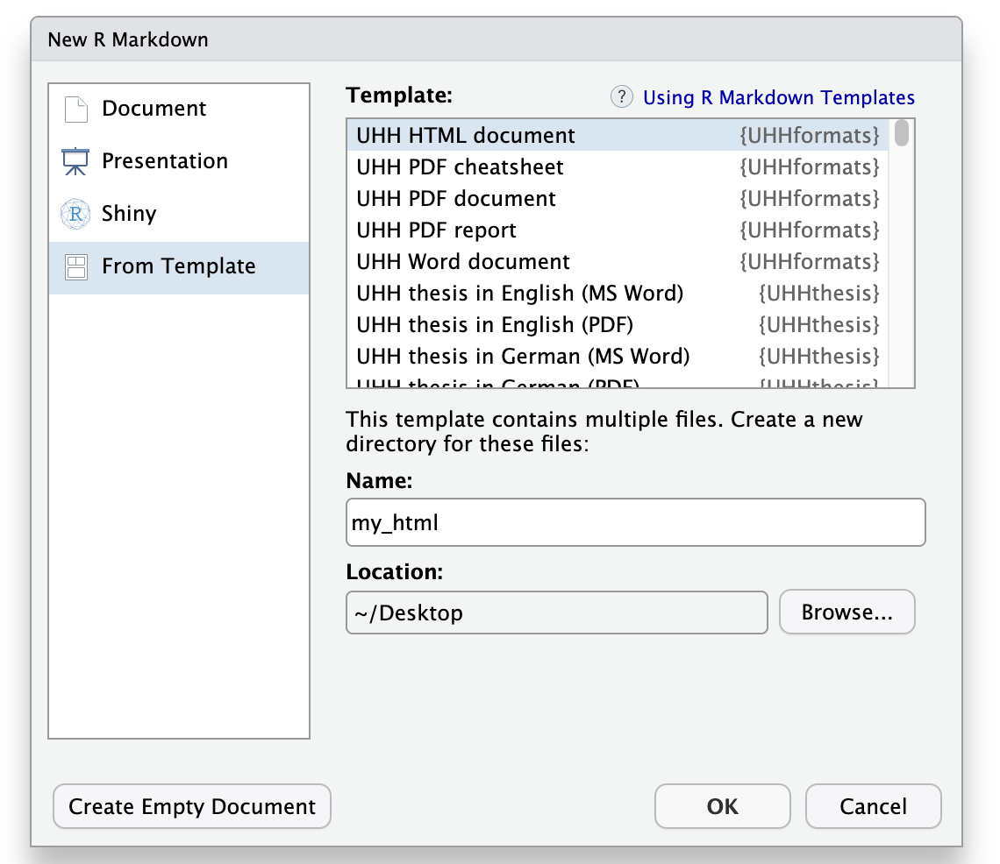

The UHHformats package provides R Markdown and Quarto templates for HTML, PDF, and Word output. This vignette shows how to create documents from these templates and render them.


## Available templates

| Template | Output | R Markdown | Quarto |
|---|---|---|---|
| HTML document | HTML | `html_doc()` | `html_doc` |
| Simple PDF | PDF | `pdf_doc()` | `pdf_doc` |
| PDF report | PDF | `pdf_report()` | `pdf_report` |
| PDF cheat sheet | PDF | `pdf_cheatsheet()` | `pdf_cheatsheet` |
| Word document | Word | `word_doc()` | `word_doc` |

All templates include example text and code demonstrating formatting, equations, tables, figures, cross-references, and citations.


## R Markdown documents

### In RStudio

1. Choose **File** > **New File** > **R Markdown** > **From Template**
2. Select one of the UHHformats templates:

```{r, echo=FALSE, fig.align='center', fig.alt="demo create document", out.width="70%"}

```

3. Choose a directory and file name, then click **OK**
4. Click **Knit** to render the document

### From the console

Use `create_rmd_doc()` to create a new directory with all template files:

```{r, eval=FALSE}
UHHformats::create_rmd_doc(dirname = "my_report", template = "pdf_report")
```

Or use the standard rmarkdown function:

```{r, eval=FALSE}
rmarkdown::draft("my_report.Rmd", template = "html_doc", package = "UHHformats")
```

Render with:

```{r, eval=FALSE}
rmarkdown::render("my_report/my_report.Rmd")
```

### YAML header example

Each template pre-fills an appropriate YAML header. For example, `html_doc`:

```
---
title: "Title"
author: "Name"
date: "`r Sys.Date()`"
output:
  UHHformats::html_doc:
    highlight: kate
    code_folding: show
    use_bookdown: true
    number_sections: false
---
```

See the help pages (e.g. `?html_doc`) for all available options.


## Quarto documents

Use `create_quarto_doc()` to set up a Quarto project:

```{r, eval=FALSE}
UHHformats::create_quarto_doc(dirname = "my_html", template = "html_doc")
UHHformats::create_quarto_doc(dirname = "my_pdf", template = "pdf_doc", font = "TheSansUHH")
```

Open the `.qmd` file in RStudio and click **Render**, or render from the console:

```{r, eval=FALSE}
quarto::quarto_render("my_html/my_html.qmd")
```

### Standalone Quarto extension

The templates are also available as a Quarto extension that can be installed without the R package:

```
quarto add uham-bio/UHHformats
```


## Font options

The default font for all templates is Helvetica. For PDF and Word templates, you can switch to the University of Hamburg's own font TheSans UHH by setting `font = "TheSansUHH"` in the YAML header (R Markdown) or via the `font` argument in `create_quarto_doc()`.


## LaTeX requirements

PDF templates require a LaTeX installation. The easiest option is [tinytex](https://yihui.org/tinytex/):

```{r, eval=FALSE}
install.packages("tinytex")
tinytex::install_tinytex()
```

You may need to install additional LaTeX packages on your first render --- tinytex handles this automatically in most cases.
